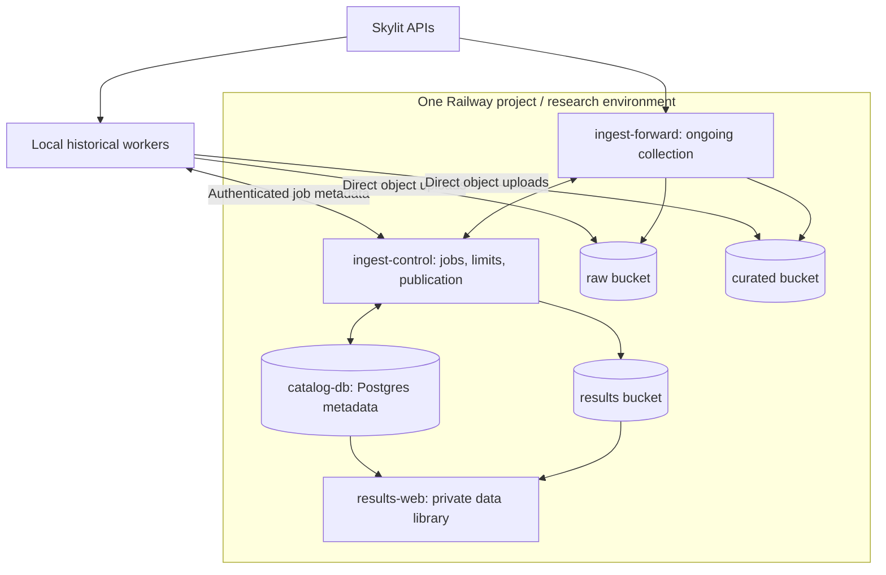

# Skylit Data Archive Blueprint

**How I organize Skylit collection into one private, versioned data archive—and how to build your own.**

The design combines local historical backfills, ongoing cloud collection, three object-storage layers, and a shared catalog. Separate development agents build the collectors; one coordinator integrates them and controls the system's total resource use.

This repository shares the architecture, collection method, configuration templates, and implementation prompts. **It contains no market data, credentials, private infrastructure identifiers, or production collector runtime.** You build and operate your own implementation using your own provider access. This is a community blueprint, independent of Skylit and Railway.

## The structure



The raw, curated, and results buckets hold the files. Postgres tells you what exists, where it is, how it was produced, and what remains missing. Local uploads go directly to object storage; the coordinator handles small metadata messages.

## Build first, enable collection separately

The default is **architecture-only with provider access disabled**. Build the software, provision approved infrastructure, and run offline checks first. Require explicit operator confirmation before any Skylit API request, including discovery probes, account checks, schema refreshes or streams. The shared request gate must remain off across restarts and deployments. See [activation control](docs/activation.md).

## Start here

1. Read [what exists versus what is being built](docs/status.md).
2. Follow [Build your own](docs/build-your-own.md) to choose your account, storage, budget, and implementation workspace.
3. Read the [architecture](docs/architecture.md), [data organization](docs/data-model.md), and [collection lifecycle](docs/collection-workflow.md).
4. Review the [dataset families and endpoint inventory](docs/datasets.md).
5. Use the [nine agent prompts](agents/README.md) to implement the system in your own repository. Start with Agent 00.

For a local copy:

```sh
git clone https://github.com/wheelieinvestor/skylit-data-archive-blueprint.git
cd skylit-data-archive-blueprint
python3 scripts/check_blueprint.py
cp config/operator.example.json config/operator.local.json
```

The check is offline and makes no API requests. Edit the ignored local configuration before starting an implementation agent. Cloning this guide does not provision infrastructure or start collection.

## What gets collected

| Family | Examples |
|---|---|
| Atlas and identity | Catalog membership, instrument identities, OHLCV, available buy/sell/unknown volume |
| Options flow | Ticker flow, premium time series, sweeps, activity, pressure and momentum |
| Contracts and open interest | Contract discovery, chains, OI changes, unusual activity, contract history and available quote context |
| Market and sectors | Market tide, breadth, sector and industry flow, rankings |
| Dark pool | Off-exchange prints and summarized levels |
| Heatseeker | Gamma/vanna matrices, daily statistics, classified levels and live velocity |
| Tempest | Volatility history, implied/realized comparisons, term structure, surfaces, cones, events and market context |

Coverage depends on your plan and actual source availability. The aim is broad field and symbol coverage first, then affordable detail. A symbol being listed, or an API returning HTTP 200, does not prove complete historical coverage.

## The operating principles

- Preserve original responses before normalization; preserve unknown fields.
- Keep large data in object storage and searchable metadata in Postgres.
- Share one scheduler, API allowance, budget ledger, and local working-space limit.
- Reuse saved source objects when improving a parser.
- Verify uploaded bytes before committing a publication or evicting a local copy.
- Record gaps, empty results, revisions, and deferred work explicitly.
- Freeze each historical release; continuously collect new observations separately.
- Use a small cloud runtime for ongoing collection and local compute for large backfills.

The reference budget is **$150/month for Railway**, divided across the entire system. It excludes your Skylit subscription, coding-agent tools, and local hardware/network costs. It is a planning example, not a claim that every metric at every frequency fits. See [budgeting](docs/budget.md).

## Repository map

```text
docs/          Architecture, data model, setup, operations and cost guide
agents/        Coordinator, seven data-family roles and dashboard prompts
config/        Blank operator configuration, budget and route inventory
templates/     Dataset, provenance and agent-handoff specifications
scripts/       Offline documentation and publication checks
```

See [the source references](docs/sources.md) for current provider/platform documentation. See [CONTRIBUTING.md](CONTRIBUTING.md) for keeping contributions free of collected data. Original material in this repository is available under the [MIT license](LICENSE); that license does not grant rights to provider data or services.
